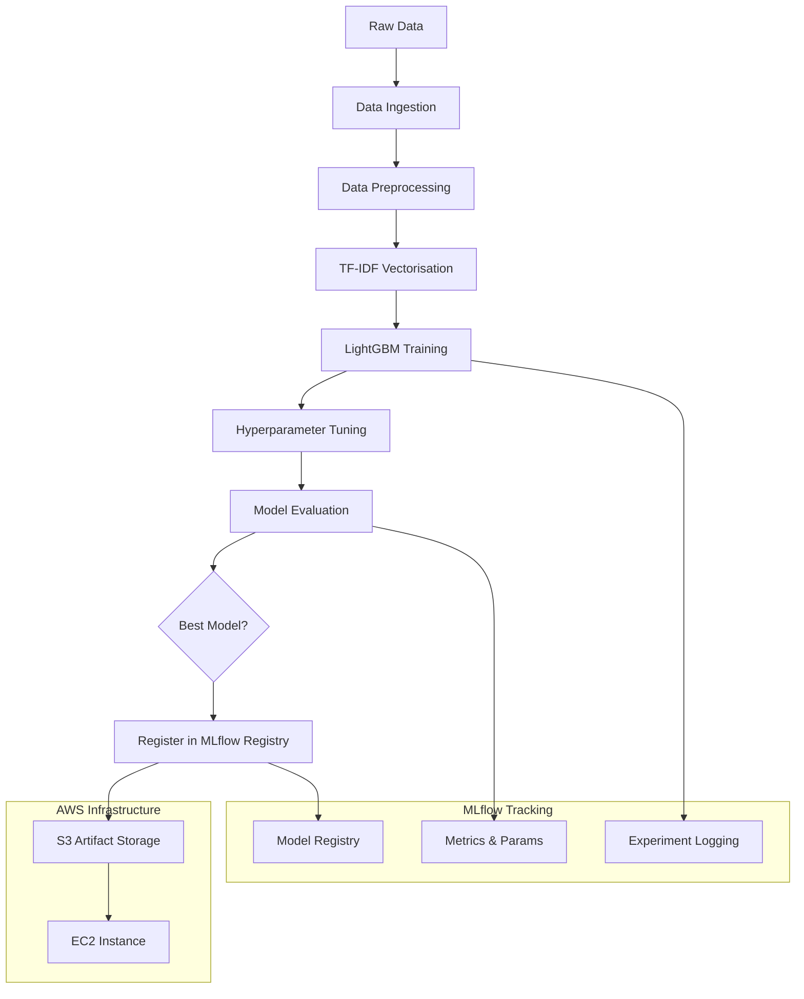
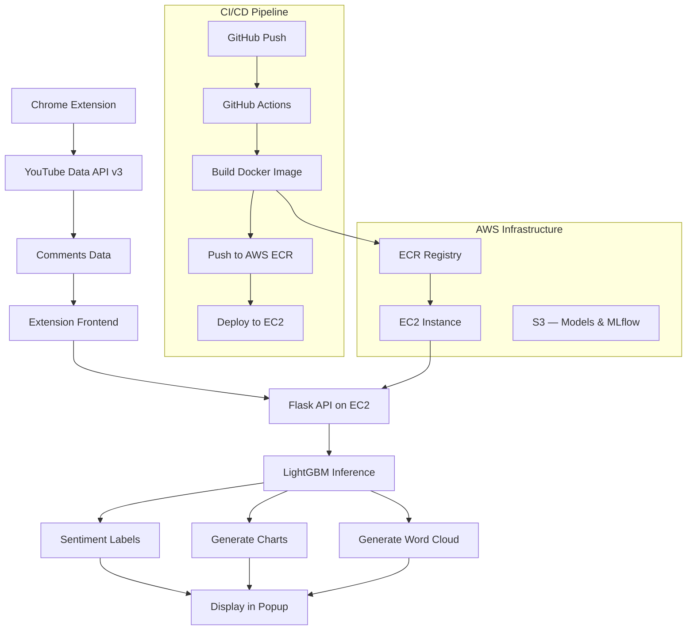

# Sentidex

A real-time YouTube comment sentiment analysis tool that leverages MLOps principles to analyse the emotional tone of YouTube comments through a browser extension.

---

## Overview

Sentidex fetches comments from any YouTube video and classifies each one as positive, neutral, or negative using a trained LightGBM model. Results are displayed instantly inside the extension popup — with a sentiment breakdown, word cloud, and trend chart — giving creators and viewers a clear picture of audience reception without reading through hundreds of comments.

It implements a complete MLOps pipeline — from raw data to a live browser extension. Models are trained through systematic experiments tracked with MLflow, versioned with DVC, and stored in S3. The trained model is containerised with Docker, pushed to AWS ECR, and served on an EC2 instance. Every push to `main` triggers an automated GitHub Actions workflow that rebuilds and redeploys the container without manual intervention.

---

## Model Training Flow

---

## Architecture
 
- **ML Pipeline & Experimentation**: Five-stage DVC pipeline with MLflow tracking every run — params, metrics, and artifacts logged automatically across experiments
- **Model Storage**: Trained models stored in S3 via MLflow artifact management for full versioning and reproducibility
- **Container Registry**: AWS ECR for Docker image storage and versioning — every push to `main` builds and pushes a new image automatically
- **Deployment**: Flask API containerised with Docker and served on AWS EC2 for scalable real-time inference
- **CI/CD**: GitHub Actions pipeline — on every push, builds the image, pushes to ECR, SSHs into EC2, and restarts the container with zero manual steps
- **Data Source**: YouTube Data API v3 (GCP) for fetching up to 100 comments per video directly from the extension
- **Frontend**: Chrome extension (Manifest V3) providing one-click sentiment analysis without leaving the YouTube page
---

## Flow Diagram

---

## Features

- Real-time sentiment analysis of YouTube comments — positive, neutral, negative
- Sentiment breakdown chart and word cloud rendered directly in the extension popup
- Full MLOps pipeline with DVC stage tracking and MLflow experiment logging
- Models versioned and stored in S3 via MLflow artifact management
- Containerised Flask API deployed on EC2 with zero-downtime CI/CD
- Browser extension for a seamless, one-click user experience

---

## Tech Stack

| Layer | Technology |
|---|---|
| ML Model | LightGBM + TF-IDF (scikit-learn) |
| Experiment Tracking | MLflow |
| Pipeline & Data Versioning | DVC |
| Artifact Storage | AWS S3 |
| API | Flask + Flask-CORS |
| Containerisation | Docker |
| Container Registry | AWS ECR |
| Deployment | AWS EC2 (Ubuntu 22.04) |
| CI/CD | GitHub Actions |
| Comment Data | YouTube Data API v3 (GCP) |
| Frontend | Chrome Extension (Manifest V3) |

---

*Built with LightGBM · MLflow · DVC · Flask · Docker · AWS S3/ECR/EC2 · GitHub Actions · YouTube Data API v3*
